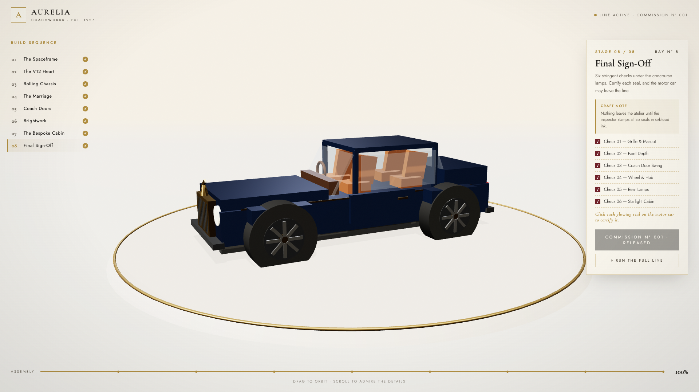

# Aurelia Coachworks · The Grand Assembly Line

An interactive 3D **luxury grand-tourer assembly line game** — built with pure Three.js in a single HTML file. No build step, no framework, no backend.

You are the line master at a fictional 1920s-style coachworks. Walk a bespoke motor car through eight stations — bare spaceframe to final sign-off — then certify six quality seals by hand before Commission Nº 001 is released from the atelier.



## Play it

```bash
git clone https://github.com/rohitguta2432/grand-assembly.git
open grand-assembly/index.html        # any modern browser, that's it
```

Append `?demo` to the URL for a ~15-second cinematic auto-run of the entire line (the mode used to record [docs/demo.mp4](docs/demo.mp4)).

## The eight stations

| # | Station | What happens |
|---|---------|--------------|
| 01 | The Spaceframe | Aluminium rails and cross-members fly in |
| 02 | The V12 Heart | 12-cylinder block with gold cam cover |
| 03 | Rolling Chassis | Forged eight-spoke wheels and suspension |
| 04 | The Marriage | The painted shell is lowered onto the chassis |
| 05 | Coach Doors | Rear-hinged doors, swung open and shut by ear |
| 06 | Brightwork | Pantheon grille, winged mascot, hand-painted coachline |
| 07 | The Bespoke Cabin | Cognac hides, walnut fascia, 90-fibre starlight headliner |
| 08 | Final Sign-Off | **Mini-game:** click six glowing seals to certify the car |

## How it works

- **Procedural car** — the entire grand tourer is ~120 Three.js primitives (boxes, cylinders, a torus) grouped into seven install units. No models, no textures downloaded.
- **Hand-rolled tween engine** — ~15 lines. Every part animates from 7 units above its resting place with staggered ease-out-back timing, so each station "rains" into position.
- **PMREM environment lighting** — metallic paint, chrome and gold get their colour from a baked `RoomEnvironment` map; without it, metals render black.
- **QC mini-game** — pulsing canvas-texture sprites raycast against pointer-up events (with a drag-distance guard so orbiting never triggers a stamp).
- **Cinematic camera** — every station has a framed camera position; lerped alongside OrbitControls so you can grab the wheel at any moment.

## Stack

Three.js `0.161` (ES modules via CDN import map) · vanilla JS · CSS. One file, ~750 lines, zero dependencies to install.

## License

MIT
